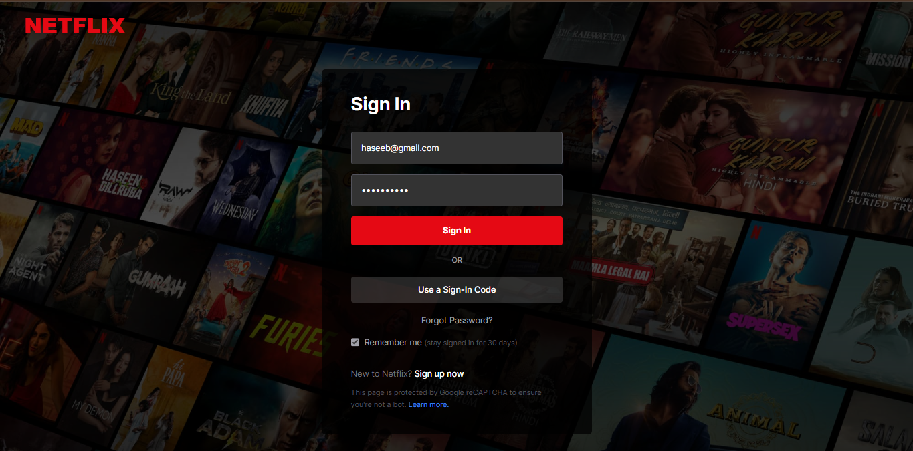
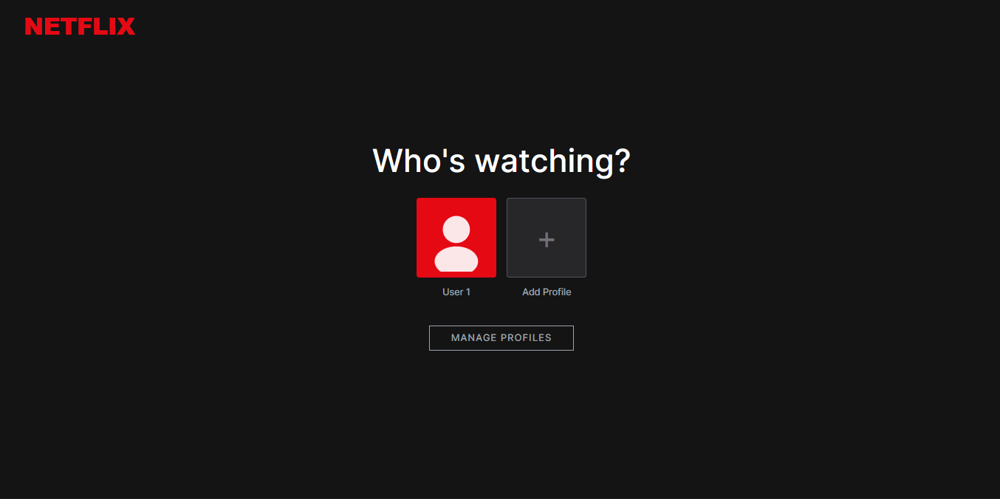
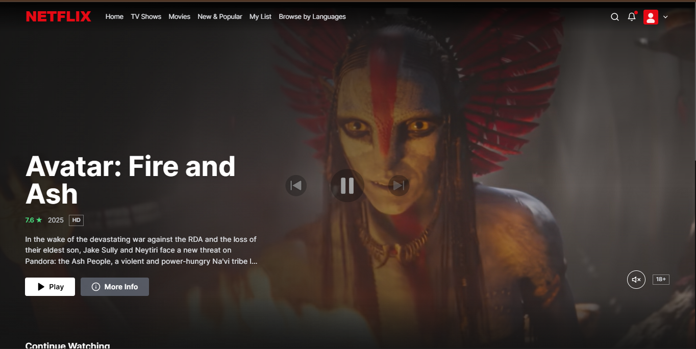
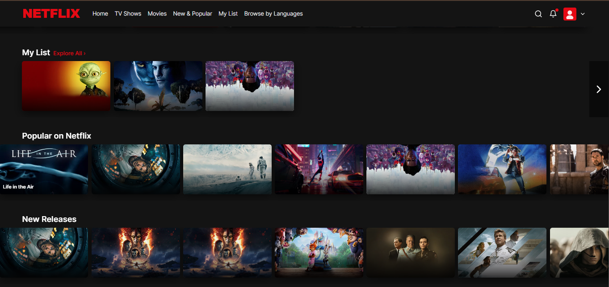
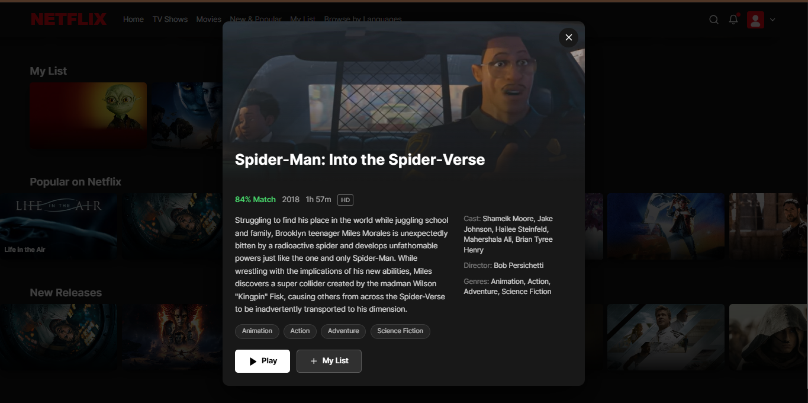
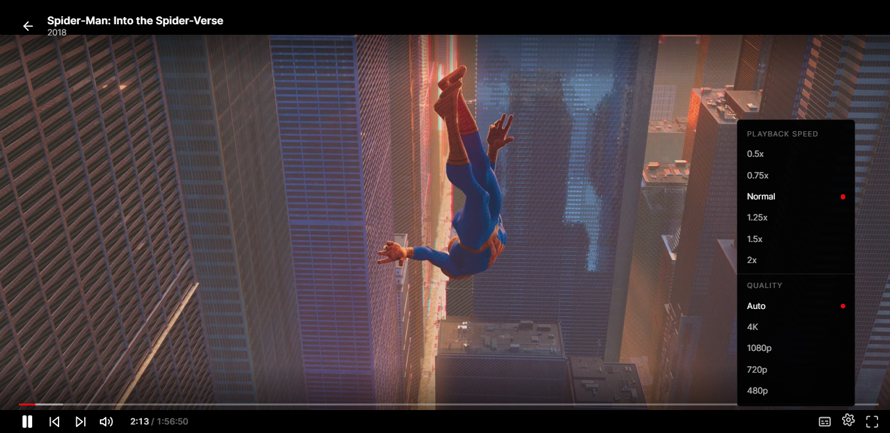

<div align="center">

# 🎬 Netflix Clone

### Personal Media Streaming Platform inspired by Netflix

A full-stack streaming platform inspired by Netflix, built with **Next.js**, **Express.js**, and the **TMDB API**. The application automatically organizes a local movie library, fetches rich metadata, streams media through a custom player, and delivers a modern Netflix-like user experience.

<p>


</p>

</div>

---

## 🎥 Project Walkthrough

> **This project cannot be deployed as a traditional live demo.**

The application streams movies from a **locally stored media library** through an Express server. Since the media files are several hundred gigabytes in size, hosting them online isn't practical.

Instead, a complete walkthrough of the application running locally is provided below.

🎥 **Project Walkthrough**

```
Replace this with your YouTube or Loom video link
```

---

# 📖 Overview

Netflix Clone is a full-stack personal streaming platform that recreates the modern Netflix experience while allowing users to stream movies from their own local collection.

Instead of relying on a commercial streaming backend, the application scans locally stored media, extracts movie information, retrieves metadata from **The Movie Database (TMDB)**, and automatically generates a rich browsing experience complete with posters, trailers, ratings, genres, and detailed movie information.

The project focuses on building production-style frontend architecture, reusable components, responsive layouts, backend integration, API consumption, and custom media playback.

---

# ✨ Features

## 🎬 Movie Library

- Automatic Local Movie Discovery
- TMDB Metadata Integration
- Automatic Posters & Backdrops
- Trending & Popular Categories
- Continue Watching
- My List
- New Releases
- Genre Organization

---

## 🔍 Search

- Instant Search
- Movie Suggestions
- TMDB Metadata Search
- Fast Filtering

---

## 👤 Profiles

- Multiple User Profiles
- Profile Selection
- Add New Profiles
- Manage Profiles
- Personalized Experience

---

## 🎥 Media Playback

- Custom Video Player
- Fullscreen Support
- Playback Controls
- Playback Speed Controls
- Keyboard Shortcuts
- Resume Playback
- Volume Controls
- Progress Tracking

> **Note**
>
> Video Quality Selection is currently **Work in Progress** and will be completed in a future update.

---

## 🎞 Movie Information

- Movie Overview
- Cast Information
- Genres
- Runtime
- Ratings
- Release Year
- Trailer Integration
- Related Movies

---

## ⚙ User Experience

- Responsive Design
- Netflix-inspired UI
- Smooth Animations
- Framer Motion Transitions
- Fast Navigation
- Modern Component Architecture# 📸 Application Showcase

## Authentication

<table>
<tr>
<td align="center">

### Sign In



</td>

<td align="center">

### Profile Selection



</td>
</tr>
</table>

---

## Home Experience

<table>
<tr>
<td align="center">

### Hero Banner



</td>

<td align="center">

### Movie Categories



</td>
</tr>
</table>

---

## Movie Details

<p align="center">



</p>

Browse detailed movie information including:

- Synopsis
- Cast
- Genres
- Runtime
- Ratings
- Add to My List
- Quick Play

---

## Custom Media Player

<p align="center">



</p>

### Features

- Fullscreen Playback
- Playback Speed Controls
- Resume Playback
- Keyboard Shortcuts
- Volume Controls
- Progress Tracking

> **Work in Progress**
>
> Video Quality Selection (Auto, 4K, 1080p, 720p, 480p) is currently under development and will be fully functional in a future update.
